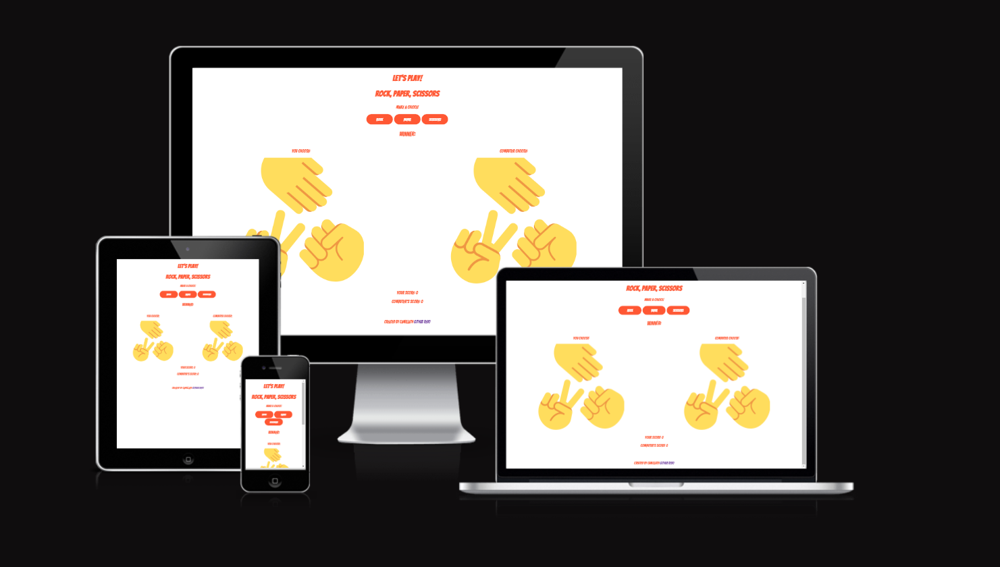
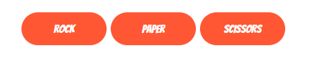
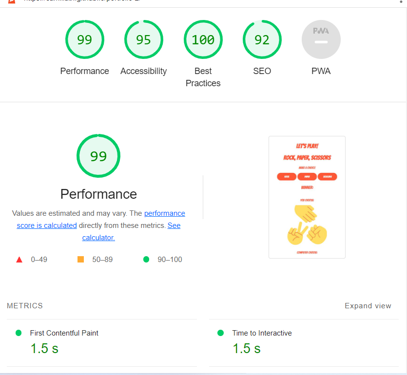

<b>Rock Paper, Scissors Game!</b>

<b>Devices:</b>

<b>The header:</b>
 
 a header with the two h tags with the name of the game and some pep text.

<b>main content:</b>

 Three buttons with the three different choices rock, paper or scissors.
 Two images representing the player and the computer.
 a text that diplay the winner of each round.
 2 texts that display the points for the player and computer.

<b>The footer:</b>

a text with the creator and a link to the github repo.

<b>Features:</b>

Choose one of the 3 by clicking one of the 3 buttons. The computer will choose 1 randomly and then the program will display the winner. After eighter the user or the computer wins it will add up score to the winner. 

<b>Lighthouse score</b>

<b>Validator Testing</b>

no bugs at the validator tool for html css and js (jslint)

<b>Deployment</b>

site is live at : https://camillath.github.io/portfolio-2/

<b>credit:</b>

Inspiration taken from code insitutes rock papper scissors game.

<b>Run program instructions:</b>

To run a frontend (HTML, CSS, Javascript only) application in Gitpod, in the terminal, type:

`python3 -m http.server`

A blue button should appear to click: _Make Public_,

Another blue button should appear to click: _Open Browser_.

To run a backend Python file, type `python3 app.py`, if your Python file is named `app.py` of course.

A blue button should appear to click: _Make Public_,

Another blue button should appear to click: _Open Browser_.